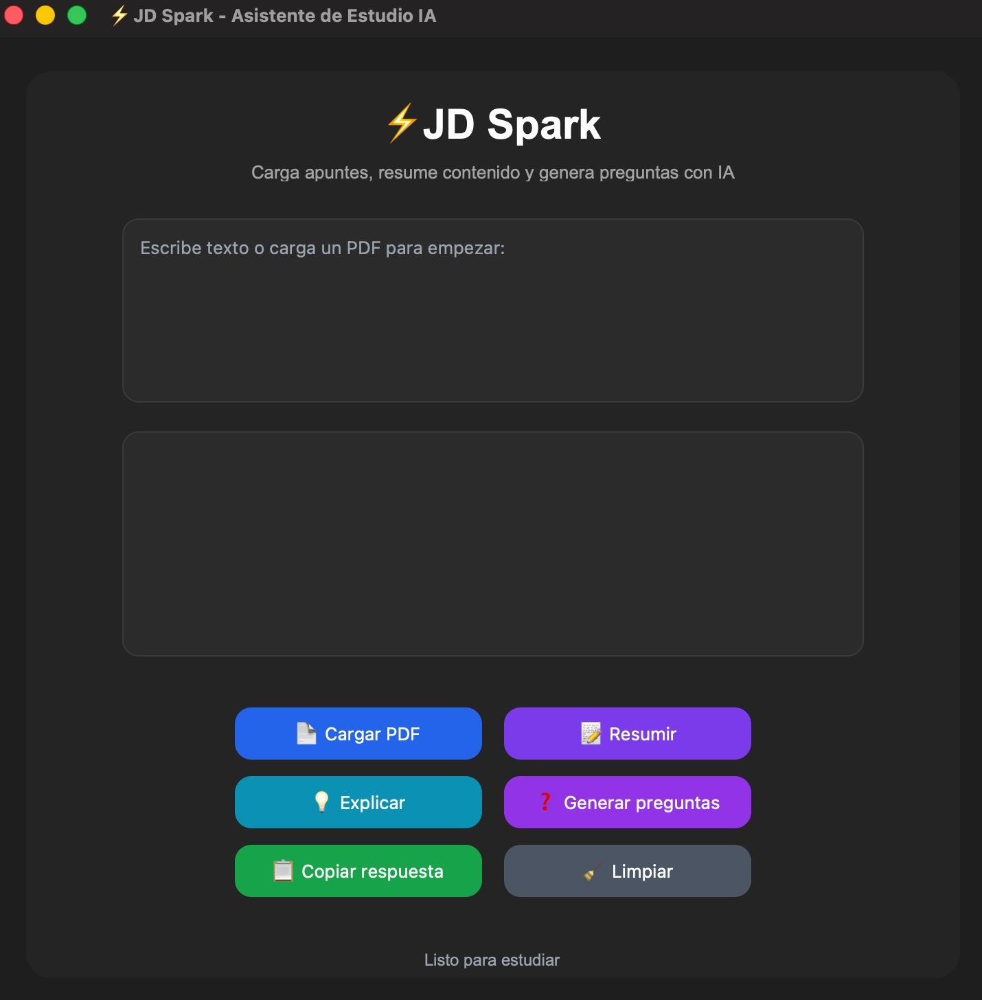

<div align="center">

# ⚡ JD Spark

**Asistente inteligente de estudio, potenciado por IA**


> *Cargá tus apuntes, preguntá lo que quieras, aprendé más rápido.*

</div>

---

## 🖼️ Vista previa

<div align="center">

<!-- 📸 Reemplazá esta URL con una captura real de tu app -->


</div>

---

## ✨ Funcionalidades

<table>
<tr>
<td align="center" width="33%">

### 📄 Carga de PDF
Extrae texto de archivos PDF con contenido seleccionable de forma automática.

</td>
<td align="center" width="33%">

### 📝 Resumir
Genera un resumen claro y conciso del texto ingresado al instante.

</td>
<td align="center" width="33%">

### 💡 Explicar Conceptos
Explica temas complejos de forma sencilla, como un tutor académico.

</td>
</tr>
<tr>
<td align="center" width="33%">

### ❓ Generar Preguntas
Crea preguntas de práctica con respuestas para repasar el contenido.

</td>
<td align="center" width="33%">

### 📋 Copiar Respuesta
Copia la respuesta generada al portapapeles con un solo clic.

</td>
<td align="center" width="33%">

### 🔐 API Key Segura
Usa un archivo `.env` para proteger tu clave de OpenAI. Sin riesgos.

</td>
</tr>
<tr>
<td align="center" width="33%">

### 🧹 Limpiar Interfaz
Reinicia todos los campos para comenzar una consulta nueva.

</td>
<td align="center" width="33%">

### 🎨 UI Moderna
Interfaz visual atractiva con CustomTkinter, sin el look clásico de Tkinter.

</td>
<td align="center" width="33%">

### 🤖 Motor GPT
Respuestas generadas directamente por la API oficial de OpenAI.

</td>
</tr>
</table>

---

## 🧠 ¿Cómo funciona?

```
┌─────────────────────┐      ┌─────────────────────┐      ┌─────────────────────┐
│      📥 INPUT        │      │     ⚙️ PROCESO        │      │      📤 OUTPUT       │
│                     │      │                     │      │                     │
│  📄 PDF cargado     │─────▶│  🧠 Prompt creado   │─────▶│  💬 Respuesta IA    │
│  ✍️  Texto escrito   │      │  📡 API consultada  │      │  📋 Lista pa' copiar │
│                     │      │  🔄 Procesando...   │      │                     │
└─────────────────────┘      └─────────────────────┘      └─────────────────────┘
```

El usuario ingresa contenido (texto o PDF), selecciona una acción, y **JD Spark** construye el prompt, lo envía a OpenAI y muestra la respuesta directamente en la interfaz.

---

## 🛠️ Stack tecnológico

<div align="center">

| Tecnología | Rol en el proyecto | Badge |
|:---:|:---|:---:|
| **Python** | Lenguaje principal |  |
| **CustomTkinter** | Interfaz gráfica moderna |  |
| **OpenAI** | Motor de inteligencia artificial |  |
| **python-dotenv** | Carga segura de API Key |  |
| **pypdf** | Extracción de texto desde PDF |  |
| **tkinter** | Ventanas emergentes y diálogos |  |
| **os** | Lectura de variables de entorno |  |

</div>

---

## 📁 Estructura del proyecto

```
⚡ JD Spark/
│
├── 🐍 main.py              # Archivo principal de la aplicación
├── 📋 requirements.txt     # Dependencias del proyecto
├── 🙈 .gitignore           # Archivos ignorados por Git
├── 📖 README.md            # Este archivo
└── 🔐 .env                 # API Key (⚠️ NO se sube a GitHub)
```

> ⚠️ **Importante:** El archivo `.env` contiene tu API Key de OpenAI. Verificá que esté incluido en `.gitignore` para **no exponerla públicamente**.

---

## ⚙️ Instalación

### 1️⃣ Clonar el repositorio

```bash
git clone https://github.com/TU_USUARIO/jd-spark.git
cd jd-spark
```

### 2️⃣ Instalar dependencias

```bash
python3 -m pip install -r requirements.txt
```

### 3️⃣ Crear el archivo `.env`

En la raíz del proyecto, creá un archivo llamado `.env` con tu clave:

```env
OPENAI_API_KEY=tu_api_key_aqui
```

> 💡 Podés obtener tu API Key en [platform.openai.com/api-keys](https://platform.openai.com/api-keys)

---

## ▶️ Ejecutar la aplicación

Desde la terminal, dentro de la carpeta del proyecto:

```bash
python3 main.py
```

---

## 📌 Guía de uso

```
① Escribís texto manualmente ──┐
                                ├──▶  ② Seleccionás acción  ──▶  ③ IA genera respuesta
② Cargás un archivo PDF      ──┘
                                                │
                                   ┌────────────┼────────────┐
                                   ▼            ▼            ▼
                               📝 Resumir  💡 Explicar  ❓ Preguntas
```

| Paso | Acción |
|:---:|:---|
| 1️⃣ | Escribí texto manualmente **o** cargá un PDF |
| 2️⃣ | Seleccioná una acción: **Resumir / Explicar / Generar preguntas** |
| 3️⃣ | Esperá la respuesta generada por IA |
| 4️⃣ | Copiá la respuesta si deseás reutilizarla |
| 5️⃣ | Limpiá la interfaz para iniciar una nueva consulta |

---

## ⚠️ Limitaciones conocidas

| ⚡ | Limitación | Detalle |
|:---:|:---:|:---|
| 🖼️ | PDFs escaneados | Solo funciona con PDFs de texto seleccionable, no con imágenes |
| 🌐 | Conexión requerida | Necesita internet para conectarse a la API de OpenAI |
| 🔑 | API Key válida | Se requiere una clave activa de OpenAI para generar respuestas |

---

## 🎯 Objetivo del proyecto

<div align="center">

> *"JD Spark nació con la misión de hacer el estudio más eficiente, accesible y dinámico."*

</div>

Combina **lectura de documentos**, **procesamiento de texto** e **inteligencia artificial** en una sola herramienta visual y sencilla.

Desarrollado como **Parcial 1** del curso de **Fundamentos de Programación** en la **Universidad Francisco Marroquín (UFM)**.

---

## 🚀 Estado del proyecto

<div align="center">

| Feature | Estado |
|:---|:---:|
| 🎨 Interfaz gráfica funcional | ✅ |
| 🤖 Conexión con OpenAI | ✅ |
| 📄 Lectura de PDFs | ✅ |
| 📝 Generación de resúmenes | ✅ |
| 💡 Explicación de conceptos | ✅ |
| ❓ Preguntas de práctica | ✅ |
| 📋 Copia de respuestas | ✅ |
| 🔐 API Key protegida con `.env` | ✅ |

</div>

---

## 👨‍💻 Autor

<div align="center">

**José Daniel Girón Cabrera**
*Fundamentos de Programación · Parcial 1 · UFM*

[](https://github.com/TU_USUARIO)

<!-- Opcional: Podés añadir tu GitHub Stats Card descomentando esto y poniendo tu username -->
<!--  -->

</div>

---

<div align="center">

*Hecho con 💙 y demasiado café ☕ · JD Spark © 2025*

</div>
